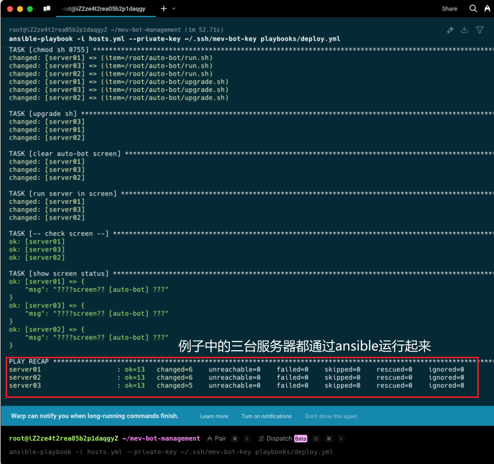

# MEV Bot Management

## 简介

这是一个用于批量运维服务器的自动化脚本，主要用于部署和管理 Rust MEV Bot 的运行

Rust MEV Bot 项目地址 https://github.com/SaoXuan/rust-mev-bot-shared

- [Discord 群聊，欢迎进来和大佬们一起搞钱](https://discord.gg/rCBZy4ZKZD)

## 使用说明

把项目克隆到一台管理服务器上（或者自己本地），推荐放在/root/目录下并进入项目根目录

### 环境安装&脚本配置

1. 确保管理机已安装 Ansible、sshpass

   Ansible 用来执行编排脚本，sshpass 用来帮助管理机登录目标机器

```bash
# 安装Ansible和依赖
sudo apt update && sudo apt install -y ansible sshpass python3-jmespath

# 验证安装
ansible --version  # 应显示2.9+
```

2. 将 `hosts.yml.template` 文件重命名为 `hosts.yml` 并根据实际情况填写服务器信息以及**差异配置**（每台目标服务器不同的部分，比如 ip_addrs 字段）。

   编写配置的时候注意格式、缩进，建议在 IDE 中编辑

3. 将加密后的私钥文件放置在 `playbooks/privatekey/` 目录下，并命名为 `PRIVATEKEY`。

   如何获取 PRIVATEKEY：在任意一台机器上成功运行过 https://github.com/SaoXuan/rust-mev-bot-shared 项目后，你可以在根目录中找到一个名为`PRIVATEKEY`的文件，把他下载并保存到项目`playbooks/privatekey/`目录中

4. 将 `playbooks\templates\config.yaml.j2.template` 文件重命名为 `config.yaml.j2`，并完善 bot **基本配置**（每台目标服务器相同的部分，比如 birdeye_api_key 字段）。

   注意：这里的配置跟 https://github.com/SaoXuan/rust-mev-bot-shared 项目中的配置是一致的，只是对**差异配置**做了模板化，差异部分从 host.yml 文件中获取

5. 确保 `~/.ssh/mev-bot-key` 文件存在并包含正确的 SSH 私钥，并且保证管理机能直接使用 ssh 连接上你的所有 bot 机器，建议使用 sshpass 工具设置管理机免密登录。

```sh
# 生成mev-bot-key ssh密钥
ssh-keygen -t rsa -b 4096 -C "mev-bot-management" -f ~/.ssh/mev-bot-key

sshpass -p 'bot1服务器ssh密码' ssh-copy-id -i ~/.ssh/mev-bot-key.pub -o StrictHostKeyChecking=no root@bot1服务器ip

sshpass -p 'bot2服务器ssh密码' ssh-copy-id -i ~/.ssh/mev-bot-key.pub -o StrictHostKeyChecking=no root@bot2服务器ip

# ... 这里需要用sshpass把所有的bot服务器配置一遍，保证管理机能获取所有bot服务器的ssh权限
```

### 使用 MEV Bot Management

运行以下命令来部署 MEV Bot：
ansible-playbook 会根据编排自动下载安装 bot 机器人，并且在名为 auto-bot 的 screen 中运行机器人。

```sh
ansible-playbook -i hosts.yml --private-key ~/.ssh/mev-bot-key playbooks/deploy.yml
```



## 常见问题
